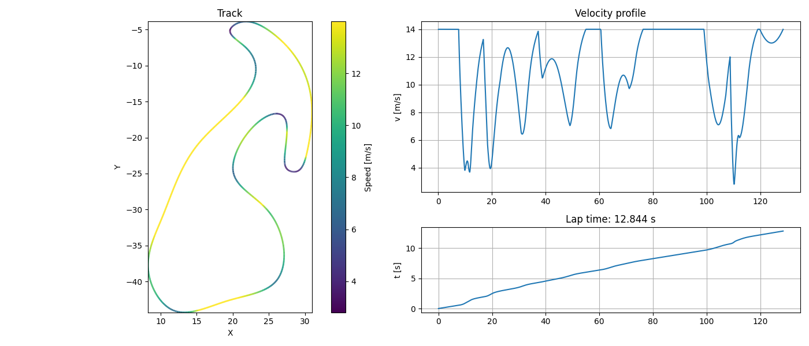

# RC Lap Time Simulation

LTS (Lap Time Simulation) for 1/10 scale RC cars. Calculate theoretical lap times based on motor physics, track geometry, and vehicle dynamics.



## Features

- **Motor Physics Simulation** - Models electric motor performance with Kv ratings, torque curves, and drag effects
- **Track Analysis** - Computes curvature from track point data and determines corner speed limits
- **Forward/Backward Pass** - Calculates achievable speed profile considering acceleration and braking limits
- **Gear Ratio Optimization** - Sweeps gear ratios to find optimal setup
- **Visualization** - Color-coded velocity profile over track with speed and time graphs

## Installation

Requires Python 3.8+ with the following dependencies:

```bash
pip install numpy scipy matplotlib
```

## Usage

### Run Default Simulation

```bash
python lap.py
```

Sweeps gear ratios from 1-20 and plots the speed-lap time relationship.

### Run Specific Gear Ratio

```bash
python -c "from lap import run_sim; lt, v = run_sim(4.5); print(f'Lap time: {lt:.2f}s')"
```

### Motor Standalone

```bash
python motor.py
```

Plots velocity, current, and power curves for different gear ratios.

### Create Custom Track

```bash
python create_track.py
```

Click along track edges on the loaded image to generate `track_points.txt`.

## Physics Model

| Parameter | Value | Description |
|-----------|-------|-------------|
| rho | 1.2 kg/m³ | Air density |
| CdA | 0.006 m² | Drag coefficient × area |
| mass | 1.32 kg | RC car mass |
| Kv | 2600 RPM/V | Motor constant |
| R | 0.0551 Ω | Motor resistance |
| wheel_radius | 0.031 m | Wheel radius |

## Project Structure

```
rc_aptime_simulation/
├── lap.py              # Main simulation (forward/backward pass)
├── motor.py           # Motor physics model
├── create_track.py    # Track point extraction from image
├── track_points.txt  # Track coordinates (x, y pairs)
└── docs/
    └── simulation_results.png  # Example output
```

## Typical Results

Expected lap times for club tracks: **2-10 seconds** depending on track size and gear ratio.